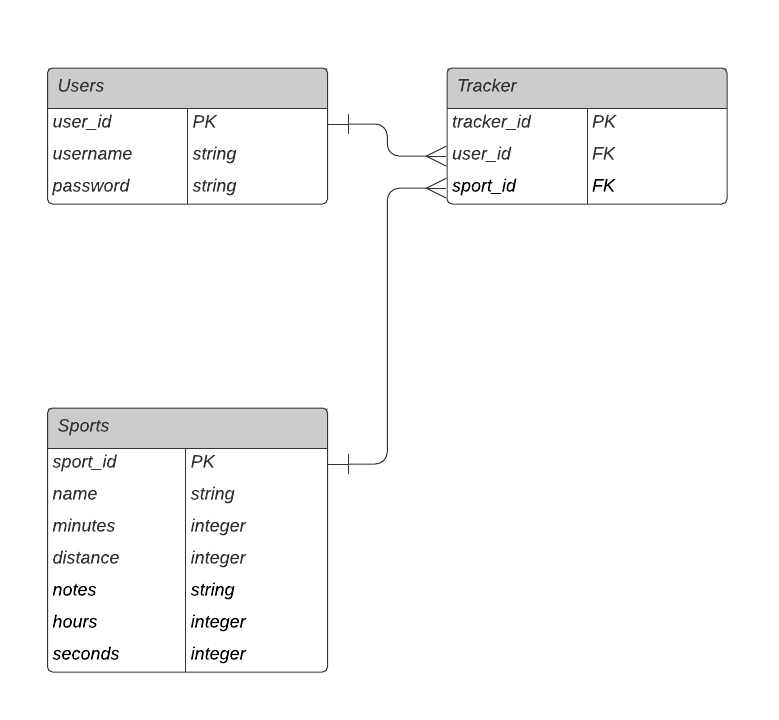

# APEX API

[Click here for frontend app](https://github.com/DcRonan/apex)


## Library Directory 📙

| Contents                  |
| ------------------------- |
| [Built With](#built-with) |
| [Live Demo](#live-demo)   |
| [Install](#install)   |
| [Testing](#testing)   |
| [Authors](#authors)       |
| [License](#license)       |

## Description

I have built a Rails API that handles data and authentication to let you track your sports & fitness workouts using a React app that I built.

## Routes

| Action  | What It Does                             | HTTP Verb | URL           |
|:-------:|:----------------------------------------:|:---------:|:-------------:|
| index   | Return a list of current sports. | GET       | `/sports`     |
| create  | Create a new sport.     | POST      | `/sports`     |
| show    | Return a single sport.  | GET       | `/sports/:id` |
| create  | Create a new user.       | POST      | `/users`       |
| session | Create a new session.    | POST      | `/login`       |

## ERD



## Built With 🛠

```
- Ruby on Rails
- Ruby
- PostgreSQL
- Heroku
- VS Code
```


## Install ⏳

> Follow these steps below to get my Application working.

1. - [ ] Open your `Terminal`
2. - [ ] Navigate to the directory where you will like to install the repo by running `cd apex-api`
3. - [ ] Run `git clone git@github.com:DcRonan/apex-api.git` to download <b>or</b> you can download using `HTTPS` by running `git clone https://github.com/DcRonan/apex-api.git` in the terminal
4. - [ ] Run `cd apex-api` to enter the directory
5. - [ ] Run `bundle install` to install Ruby Gems (<b>hint:</b> Mac users, if not working then run `sudo bundle install`)
6. - [ ] Run `rails db:create` to create a local database
7. - [ ] Run `rails db:migrate` to migrate the database
8. - [ ] Run `rails s` to start up the server
9. - [ ] Open `http://localhost:3000/` in your browser


## Testing ⚙

> I have used linters to test my code, which includes: [rspec](https://rspec.info/)

1. - [ ] Open `Terminal` again
2. - [ ] Run `cd apex-api` to enter the directory
3. - [ ] Run `rspec` to start testing
4. - [ ] All tests will pass ✅


## Authors

### 👨‍💻 Daniel Ronan

[](https://github.com/DcRonan) <br>
[](https://www.linkedin.com/in/dan-ronan/) <br>
[](mailto:danielconnorronan@gmail.com) <br>
[](https://twitter.com/dc_ronan)

### 🤝 Contributing

Contributions, issues and feature requests are welcome!

Feel free to check the [issues page](https://github.com/DcRonan/apex-api/issues).

### Show your support

Give a ⭐️ if you like this project!

### License

